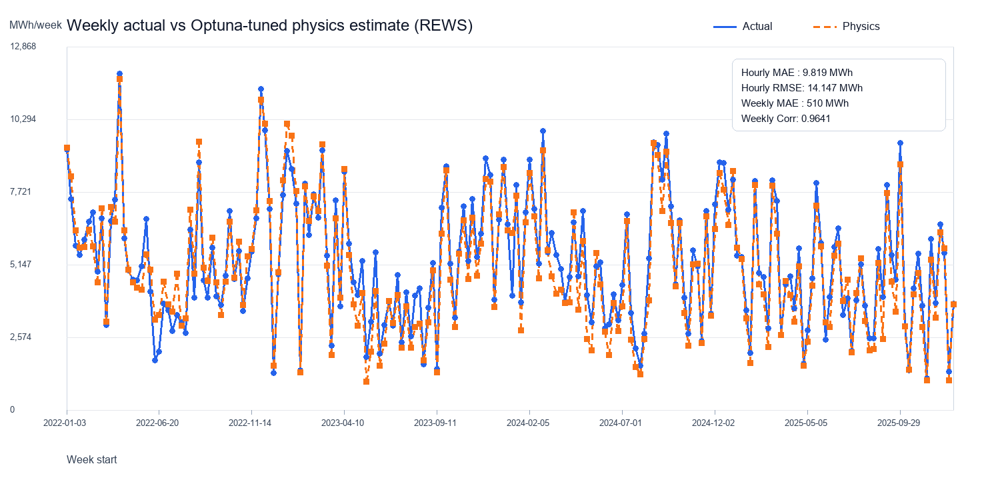

# Решение задачи прогнозирования выработки электроэнергии ВЭС

## Хакатон: Прогнозирование производства электроэнергии ветроэлектростанцией

### Команда: **Tailwind**

## Навигация

- [Гайд воспроизведения реализации](Playback.md)
- [Предобработка и feature engineering](pipeline/step1_preprocess.py)
- [Скачивание ERA5](pipeline/step2_download_era5.py)
- [Извлечение ERA5-признаков](pipeline/step2_era5_features.py)
- [Обучение и предсказание](pipeline/step3_train_predict.py)

---

# 1. Постановка задачи

Целью работы являлось построение модели, способной предсказывать почасовую выработку электроэнергии ветроэлектростанцией на период первого квартала 2026 года на основе:

* исторической генерации станции;
* метеорологических данных;
* технических характеристик ВЭС.


---

# 2. Исходные данные

В ходе работы использовались:

* исторические данные генерации ВЭС за 2022–2025 годы;
* метеоданные Open-Meteo;
* дополнительные атмосферные данные ERA5 (ECMWF Reanalysis).

В данных присутствовали:

* скорость ветра на разных высотах;
* направление ветра;
* температура;
* давление;
* осадки;
* информация о ремонте турбин;
* временные признаки.

Особое внимание уделялось прогнозированию зимнего периода (Q1), поскольку именно для него требовалось итоговое предсказание.

---

# 3. Подготовка данных и feature engineering

Код этапа: [pipeline/step1_preprocess.py](pipeline/step1_preprocess.py).

## 3.1 Обработка пропусков

В данных присутствовали пропуски для высот 180 м.
Для восстановления использовался степенной профиль ветра:

$$
V_h = V_{ref}\left(\frac{h}{h_{ref}}\right)^\alpha
$$

где коэффициент (\alpha) вычислялся по известным скоростям на соседних высотах.

Это позволило восстановить недостающие значения без потери временных интервалов.

---

## 3.2 Генерация признаков

Для повышения качества модели были сформированы дополнительные признаки:

### Временные признаки

* час суток;
* день недели;
* месяц;
* циклические sin/cos преобразования времени.

### Физические признаки

* куб скорости ветра $(v^3)$;
* плотность воздуха;
* вертикальный wind shear;
* turbulence indicators.

### Скользящие статистики

* rolling mean;
* rolling std;
* признаки изменения ветра во времени (wind ramp).

### Признаки направления ветра

Направление кодировалось через sin/cos преобразование для устранения разрыва между 0° и 360°.

---

# 4. Использование ERA5

Код этапа: [pipeline/step2_download_era5.py](pipeline/step2_download_era5.py) и [pipeline/step2_era5_features.py](pipeline/step2_era5_features.py).

Дополнительно были подключены данные глобального реанализа ERA5:

* скорость ветра на 100 м;
* высота пограничного слоя атмосферы (BLH);
* температура;
* атмосферные параметры.

ERA5 позволил добавить более устойчивое описание состояния атмосферы, чем обычные прогнозные данные.

Наибольший вклад внесли:

* скорость ветра на высоте 100 м;
* высота пограничного слоя.

Часть других признаков ERA5 была протестирована, но исключена из финальной версии из-за переобучения.

---

# 5. Валидация модели

Одной из ключевых частей решения стала собственная схема временной валидации.

Вместо случайного разбиения использовались три последовательных фолда:

| Обучение  | Валидация |
| --------- | --------- |
| 2022      | Q1 2023   |
| 2022–2023 | Q1 2024   |
| 2022–2024 | Q1 2025   |

Такой подход позволил:

* избежать утечки будущих данных;
* приблизить условия обучения к реальному прогнозированию;
* выявлять переобучение на отдельных годах.

Новый признак принимался только в том случае, если улучшал качество на всех временных фолдах.

---

# 6. Архитектура решения

Код обучения и финального ансамбля: [pipeline/step3_train_predict.py](pipeline/step3_train_predict.py).

Финальное решение представляло собой ансамбль из:

* физической модели;
* CatBoost;
* LightGBM.

---

## 6.1 Физическая модель

Использовалась модель, основанная на физике ветроэнергетики:

$$
P = \frac{1}{2}\rho A V^3 C_p
$$

где:

* $\rho$ — плотность воздуха;
* $A$ — площадь ротора;
* $V$ — скорость ветра;
* $C_p$ — коэффициент эффективности турбины.

Также применялся REWS (Rotor Equivalent Wind Speed) — эквивалентная скорость ветра по площади ротора.



Физическая модель обеспечивала:

* устойчивость;
* хорошую обобщающую способность;
* корректное поведение на экстремальных значениях.

---

## 6.2 CatBoost

CatBoost использовался как основная ML-модель благодаря:

* хорошей работе с табличными данными;
* устойчивости к шуму;
* способности моделировать сложные нелинейные зависимости.

Особенностью решения стало обучение только на зимних месяцах:

```python
{11, 12, 1, 2, 3, 4}
```

Это позволило убрать летние распределения, мешающие прогнозированию Q1.

---

## 6.3 LightGBM

Дополнительно использовался LightGBM.

Он показал лучшие результаты на поздних временных фолдах, где объём обучающих данных был больше.

LightGBM особенно хорошо моделировал:

* сложные переходные режимы;
* нелинейности в ramp-zone;
* нестабильные мартовские периоды.

---

# 7. Ансамблирование

Наилучший результат был достигнут при объединении:

* физической модели;
* CatBoost;
* LightGBM.

Идея ансамбля:

* физика обеспечивает устойчивость и физическую корректность;
* ML-модели улавливают сложные паттерны и нелинейности.

Оптимальный диапазон весов:

* 40–50% физическая модель;
* 50–60% ML.

---

# 8. Основные сложности задачи

## 8.1 Ramp-zone

Наиболее сложной областью оказались скорости ветра 6–10 м/с.

В этой зоне турбина переходит от низкой генерации к режиму максимальной мощности.

Из-за высокой нелинейности ошибка модели в этом диапазоне максимальна.

---

## 8.2 Сезонный сдвиг

Март оказался значительно сложнее января и февраля из-за перехода между зимними и весенними атмосферными режимами.

Это стало одной из причин использования сезонной фильтрации при обучении.

---

# 9. Результаты

Лучший результат нашей команды был достигнут после:

* подключения ERA5;
* внедрения Multi-Q1 CV;
* ансамблирования физики и ML.

Финальное решение продемонстрировало стабильное снижение ошибки относительно базовых моделей.

---

# 10. Выводы

В ходе работы были сделаны следующие выводы:

1. Для задач энергетики важно сочетать:

   * физические модели;
   * методы машинного обучения.

2. Временная валидация критически важна для предотвращения переобучения.

3. ERA5 существенно улучшает качество прогноза при корректном использовании.

4. Ансамбль моделей показывает значительно более устойчивый результат, чем одиночная модель.

5. Сезонная фильтрация данных позволяет лучше адаптировать модель под целевой период прогноза.

---

# 11. Технологии

В работе использовались:

* Python;
* Pandas;
* NumPy;
* CatBoost;
* LightGBM;
* Scikit-learn;
* Xarray;
* ERA5 / ECMWF.

---

# 12. Итог

Разработанное решение представляет собой гибридную систему прогнозирования, объединяющую:

* физическое моделирование;
* инженерные признаки;
* ансамбли градиентного бустинга;
* временную валидацию.

Такой подход позволил добиться высокой устойчивости модели и хорошего качества прогноза на реальных временных данных.

Основано на файле отчёта команды и правилах хакатона 
